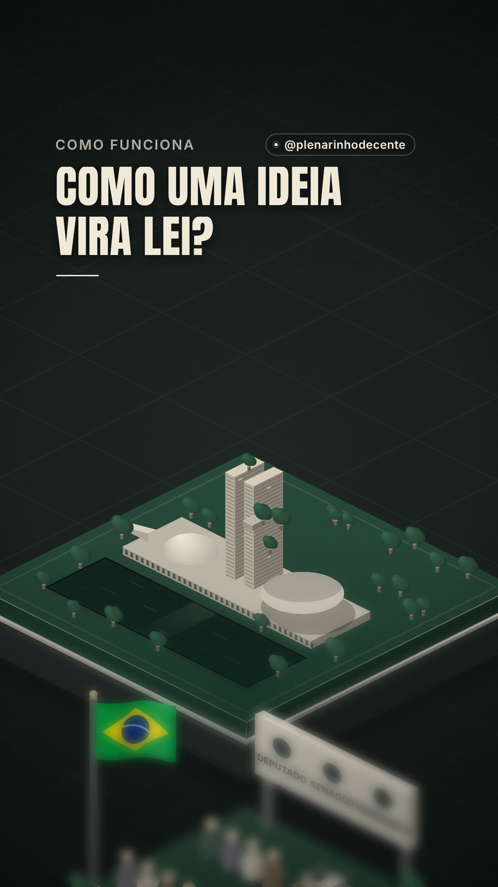

# Política em 2 minutos

Série de Reels do **@plenarinhodecente** que explica como a política brasileira funciona, em até 2 minutos,
com uma maquete animada. **Tom 100% neutro:** mostra só as regras e os processos, sem partidos, sem
pessoas e sem tomar lado. Cada informação é conferida na fonte oficial (Constituição, leis e sites da
Câmara e do Senado) antes de gravar.

## Episódios

| # | Reels | Status | Pasta |
|---|---|---|---|
| 1 | **Como uma ideia vira lei?** O caminho de um projeto de lei, da proposta até o Diário Oficial. | Pronto (1min34) | [`como-nasce-uma-lei/`](como-nasce-uma-lei/) |

## Próximos temas (a escolher)

| Tema | Gancho |
|---|---|
| Voto proporcional | Por que alguém com 500 mil votos pode não se eleger, e outro com 10 mil se elege? |
| Emendas parlamentares | Todo ano, bilhões do Orçamento são distribuídos pelos próprios deputados. Como? |
| Fundo eleitoral e fundo partidário | Quanto dinheiro público vai para campanhas e como ele é dividido? |
| Impeachment | Quem decide tirar um presidente, e quantos votos são precisos? |
| Foro privilegiado | O que é e quem tem? |
| Quanto custa um deputado | Salário, verba de gabinete e cota parlamentar. |

## Padrão da série

- **Formato:** vertical 1080×1920, até 2 minutos, 30 fps.
- **Visual:** maquete isométrica contínua (zoom in na estação, zoom out para o todo, zoom in na próxima),
  acabamento "flat geométrico" com sombras longas.
- **Paleta:** carvão `#101513`, verde profundo `#183C2C`, verde acinzentado `#506256`, papel creme `#F0E9D8`.
- **Tipografia:** Anton (títulos), Inter (apoio e balões), IBM Plex Mono (números).
- **Área segura:** textos entre x 96–900 e y 288–1248; `@plenarinhodecente` fixo no canto superior direito dessa área.
- **Balões:** um por vez na tela.
- **Som:** trilha sintetizada (sem direitos autorais), efeitos sincronizados com a animação, música abaixada sob a voz, −14 LUFS.

## Como um episódio é feito

1. Roteiro de até ~290 palavras, conferido artigo por artigo (fontes no `ROTEIRO.md` de cada pasta).
2. Aprovação do texto e geração da narração (voz IA).
3. Ajuste do áudio (pausas encurtadas, ritmo acelerado) e sincronia da animação com a fala.
4. Desenho de som (`som/`) e render final (`render.mjs`).

Os vídeos finais e a voz gravada **não** ficam neste repositório (ele é público); só o código, o roteiro e a capa.
